<div align="center">


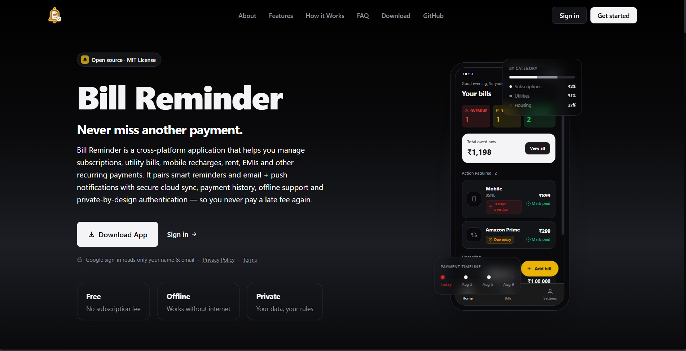

<br>

# 🔔 Bill Reminder

### A private, cross-platform way to stay ahead of recurring payments.

<p>
  <a href="https://billreminder.suryadeepbanerjee.in">
    
  </a>
  <a href="https://github.com/suryadeepbanerjee/Bill-Reminder/blob/main/LICENSE"></a>
  <a href="https://github.com/suryadeepbanerjee/Bill-Reminder/commits/main"></a>
  <a href="https://billreminder.suryadeepbanerjee.in"></a>
</p>

<p>
  <a href="https://expo.dev"></a>
  <a href="https://vitejs.dev"></a>
  <a href="https://supabase.com"></a>
  <a href="https://www.typescriptlang.org"></a>
  <a href="https://tailwindcss.com"></a>
</p>

<p>
  
</p>

</div>

---

<details>
<summary><b>Table of contents</b></summary>

- [The idea](#the-idea)
- [Product tour](#product-tour)
- [Bill lifecycle at a glance](#bill-lifecycle-at-a-glance)
- [Designed around recurrence](#designed-around-recurrence)
- [Add a bill](#add-a-bill)
- [Bill details](#bill-details)
- [Web dashboard](#web-dashboard)
- [Settings and privacy](#settings-and-privacy)
- [Architecture](#architecture)
- [Technology](#technology)
- [Security is part of the architecture](#security-is-part-of-the-architecture)
- [Household model](#household-model)
- [Reminder pipeline](#reminder-pipeline)
- [Engineering details](#engineering-details)
- [Project structure](#project-structure)
- [Running locally](#running-locally)
- [Deployment](#deployment)
- [Roadmap](#roadmap)
- [License](#license)

</details>

---

## The idea

Most bill trackers stop at storing a due date.

Bill Reminder is built around what happens *after* that: recurring cycles, reminders, payment history, household access, authentication, and the small details that make a reminder system dependable rather than decorative.

It gives you one place to see what needs attention, what is coming next, and what has already been paid.

The project is deliberately **mobile-first**, with a production web dashboard that shares the same backend, the same data model, and the same recurrence engine — not a lookalike rebuilt from scratch.

---

## Product tour

<table>
<tr>
<td width="50%" valign="top">

### Home

A quick view of the financial work that actually needs attention.

- Overdue, due-today, and upcoming counts
- Total amount currently owed, with one tap into the full list
- An **Action Required** section — bills that need a decision today
- Upcoming payments, sorted by due date
- Quick "Mark paid" directly from the summary, no need to open the bill

</td>
<td width="50%" valign="top">

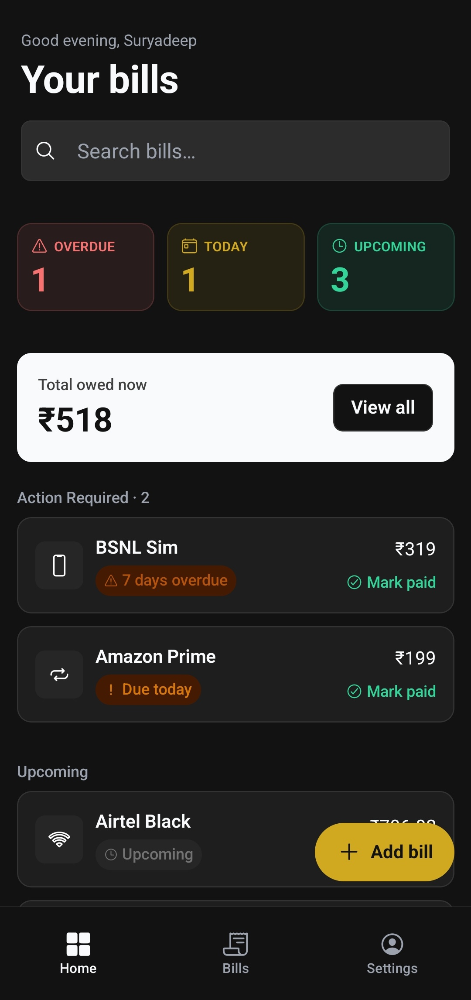

</td>
</tr>
</table>

<br>

<table>
<tr>
<td width="50%" valign="top">

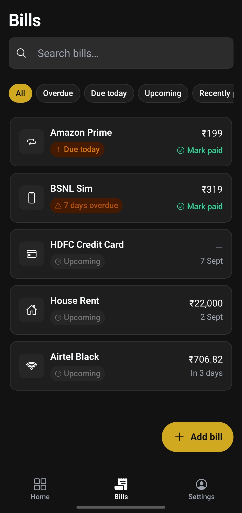

</td>
<td width="50%" valign="top">

### Bills

A focused bill list with search and five state filters — All, Overdue, Due today, Upcoming, Recently paid.

Bills can represent subscriptions, utilities, rent, credit cards, EMIs, insurance, education, hosting and other recurring expenses — 18 categories ship out of the box.

The list itself is simple on purpose. The important part is the recurrence model that decides what shows up in it, and when.

</td>
</tr>
</table>

---

## Bill lifecycle at a glance

Every occurrence of a bill moves through one of seven states, computed server-side — never hardcoded on the client:

| State | Meaning |
|---|---|
|  | Cycle exists, nothing to do yet |
|  | Occurrence has materialized ahead of the generation date |
|  | Inside the expected payment window |
|  | Due date is today |
|  | Past due, still unpaid — shown as "N days overdue" |
|  | Settled, with a payment record attached |
|  | Historical, kept for reference |

`paid` and `archived` occurrences are treated as **immutable history** — the recurrence engine never rewrites them, only ever adds the next cycle.

---

## Designed around recurrence

A recurring payment is not simply `due_date + 30 days`. Bill Reminder models it as two independent choices, and every screen in the app is built on top of that pair:

<table>
<tr>
<td width="50%" valign="top">

**How the amount behaves**

- **Fixed due date** — rent, EMIs, utilities: due day is anchored to the cycle, amount is usually known
- **Prepaid / validity** — recharges and subscriptions paid upfront, next cycle shifts from the *actual* payment date
- **Wallet balance** — usage-based, checked on an interval rather than a fixed due date

</td>
<td width="50%" valign="top">

**How often it repeats**

- Monthly, anchored to a day of the month
- Yearly, anchored to a month + day
- Every X days / weeks / months
- One-time — exists once, then leaves the active schedule

</td>
</tr>
</table>

A single `anchor_date` is the only reference point the engine trusts; everything else — due date, generation date, expected-payment window — is derived from it through the same helper functions used by both the live schedule and the create/edit preview, so the UI can never show a date the backend wouldn't actually generate.

The engine also supports overriding *which* cycle is "next due" — useful for a bill you forgot to log for a few months. Pick a past cycle in the schedule preview and the whole overdue chain materializes in one shot; pick a future one and the nearer cycles are skipped, not silently lost.

That correctness didn't happen on the first attempt — the recurrence engine went through several genuinely wrong versions (an infinite-loop bug that generated occurrences into the year 2437 is a personal favorite mistake) before landing on its current canonical form, which is now covered by an explicit regression suite before any migration touching it ships.

---

## Add a bill

The creation flow is intentionally split into three steps, all backed by the same recurrence engine described above:

<table>
<tr>
<td width="33%" align="center">

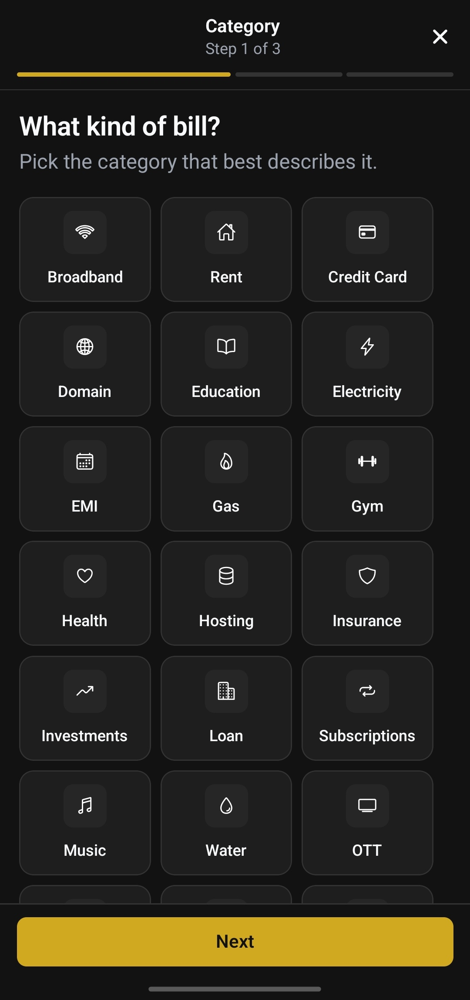

**01 — Category**

Choose the type of bill.

</td>
<td width="33%" align="center">

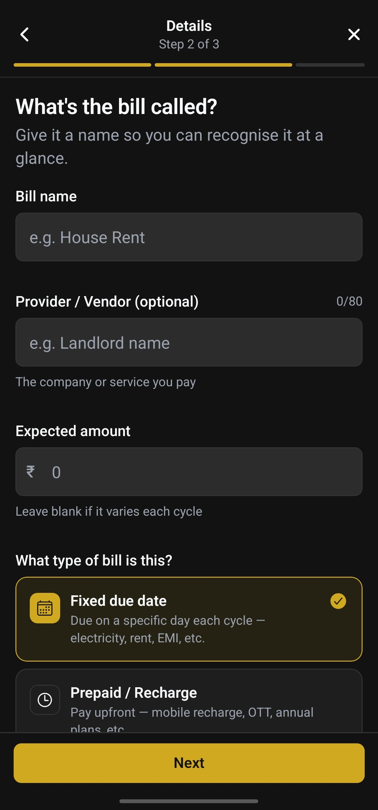

**02 — Details**

Name, provider, expected amount, and billing model.

</td>
<td width="33%" align="center">

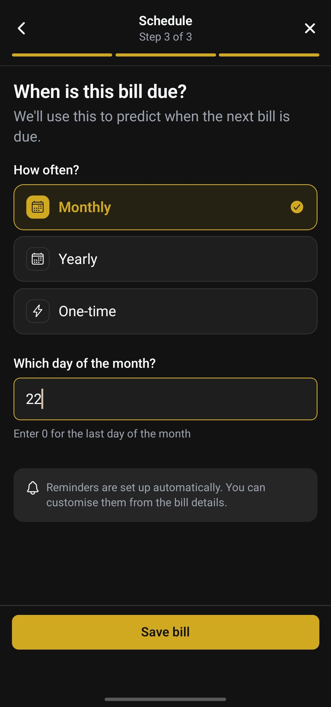

**03 — Schedule**

Frequency and date anchor, with a live preview of the next few occurrences.

</td>
</tr>
</table>

This is backed by React Hook Form and Zod validation rather than trusting the UI to behave itself, because users have a remarkable talent for finding the one input path nobody tested.

---

## Bill details

This is the screen the rest of the app quietly points to — every push notification, every reminder email, and every "Mark paid" tap eventually lands here. It's the single place where a bill's full lifecycle — not just its due date — lives.

<table>
<tr>
<td width="50%" valign="top">

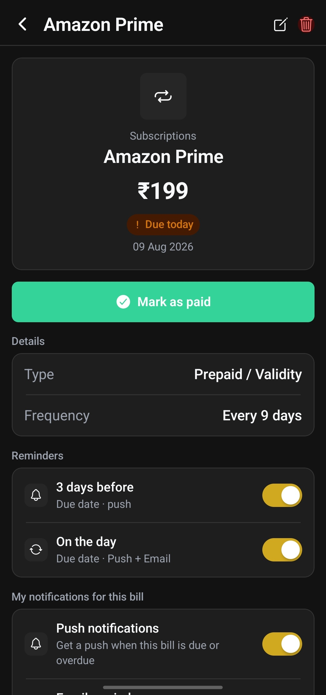

</td>
<td width="50%" valign="top">

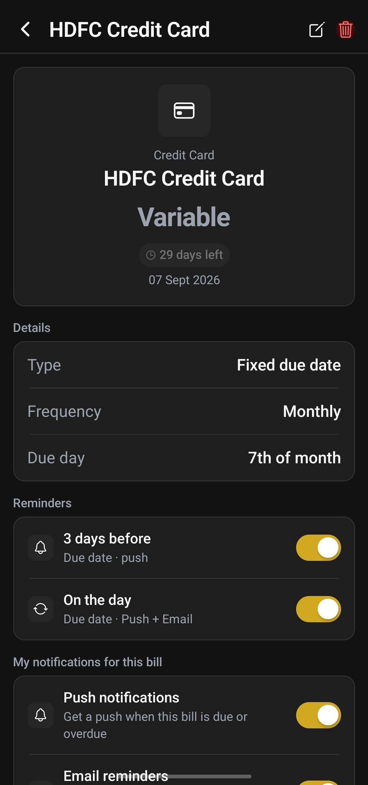

</td>
</tr>
</table>

**Hero card** — category icon and label, the bill's title, and its amount for the current cycle. That amount reads **"Variable"** instead of a number whenever the bill has no fixed expected amount, which is exactly what the HDFC Credit Card example above shows. Below it, a live state chip (`Due today`, `29 days left`, `7 days overdue`, …) and the due date for the current cycle.

**Mark as paid** — one tap opens a modal pre-filled with the expected amount and today's date, with optional notes. For prepaid/wallet bills there's an extra toggle to shift the recurrence anchor to the *actual* payment date rather than the original schedule — useful when a recharge lands a few days early or late and you don't want the next cycle to drift.

**Details** — the billing model in plain terms: **Type** (Fixed due date / Prepaid · Validity / Wallet balance), **Frequency** (Monthly, Yearly, Every N days, One-time — the Amazon Prime example above is set to repeat every 9 days), and, for fixed-due-date bills, the anchored **Due day** of the month.

**Reminders** — per-bill reminder rules, each with its own anchor (generation date, expected-payment date, or due date), offset, and delivery channel. Every new bill ships with two defaults — *3 days before* (push) and *on the day* (push + email) — and each is independently toggled from this screen, not buried in account-wide settings.

**My notifications for this bill** — a second, bill-level override for push and email delivery that sits on top of (and can diverge from) the account-wide notification settings in Settings.

**Payment history, not just a checkbox** — marking a bill paid writes an actual payment record: amount, date, notes, and an optional receipt path. That record is what lets you undo a mistake correctly. Deleting a logged transaction rolls the schedule back: fixed-due-date bills simply drop the record, while prepaid/wallet bills let you choose whether the anchor should stay put, revert to the previous payment, or move to a custom date — so the next due date never ends up lying to you.

**Edit and delete** — the pencil icon reopens the same three-step sheet used at creation, pre-filled and validated identically. Editing anything recurrence-related (frequency, anchor, due day) rebuilds the *entire* future chain from the new definition rather than leaving stale occurrences sitting around; the trash icon removes the bill outright.

---

## Web dashboard

The web application is not a separate product bolted onto the side. It is a feature-parity port of the mobile experience — same Supabase backend, same query keys, same recurrence and reminder behaviour, same component logic ported to Tailwind.

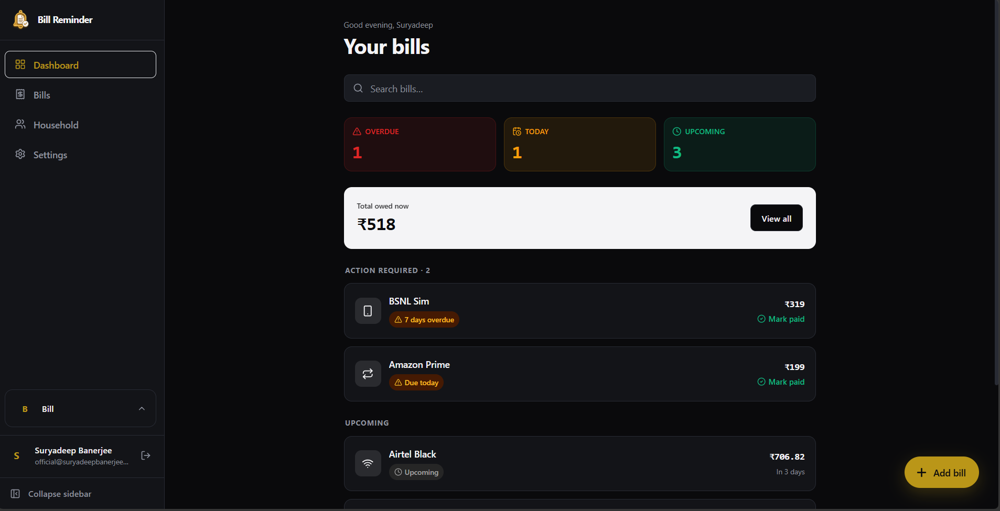

### Desktop application shell

- Persistent sidebar navigation — Dashboard, Bills, Household, Settings
- Dashboard, bills list, three-step add-bill wizard, bill detail, settings and household management, all at feature parity with mobile
- Responsive layout that collapses to a mobile top bar + bottom nav on small screens
- Dark / light / system theme, with a deliberate "always dark" landing page
- Export to JSON straight from the browser (mobile uses the native share sheet instead)

### Authentication

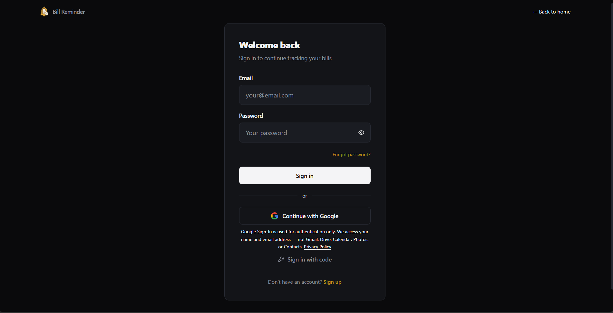

Supabase Auth backs email/password, Google Sign-In, and a passwordless **sign-in with code** (OTP) path — the same auth core the mobile app uses, just PKCE over `localStorage` instead of `SecureStore`.

---

## Settings and privacy

<table>
<tr>
<td width="50%" valign="top">

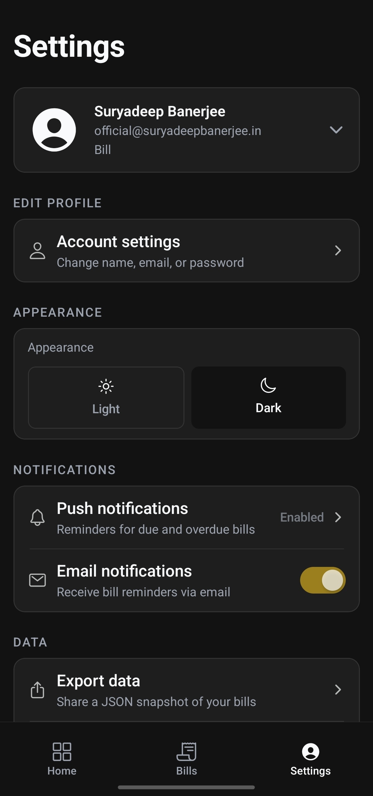

</td>
<td width="50%" valign="top">

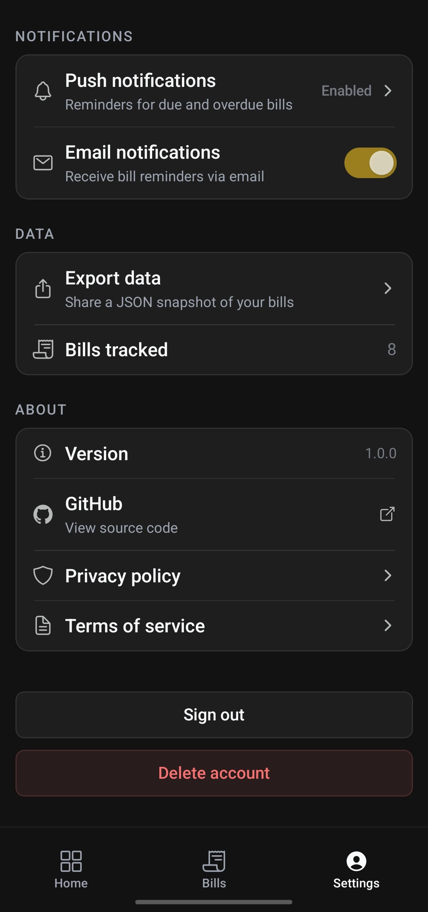

</td>
</tr>
</table>

The settings area keeps account, appearance, notification and data controls together, rather than scattering them across the app.

It includes:

- Profile management and household switcher
- Account settings — name, email, password
- Light / dark appearance control
- Push notification permission status, surfaced honestly rather than assumed
- Email notification toggle
- JSON data export — "your data, your rules" isn't just landing-page copy
- Account deletion with OTP verification
- Household management and role controls

---

# Architecture

```text
                         ┌─────────────────────────┐
                         │       Bill Reminder     │
                         └────────────┬────────────┘
                                      │
                    ┌─────────────────┴─────────────────┐
                    │                                   │
             Mobile Client                         Web Client
          React Native + Expo                    React + Vite
                    │                                   │
                    └─────────────────┬─────────────────┘
                                      │
                          packages/shared (types,
                        Zod schemas, adapter factories)
                                      │
                         ┌────────────▼────────────┐
                         │       Supabase          │
                         │                         │
                         │ PostgreSQL              │
                         │ Auth + RLS              │
                         │ RPCs + triggers         │
                         │ Edge Functions          │
                         └────────────┬────────────┘
                                      │
                    ┌─────────────────┼─────────────────┐
                    │                 │                 │
                 pg_cron          Upstash Redis       Resend
                    │             rate limiting       email
                    │
          occurrence generation
          reminder materialization
          reminder dispatch
                    │
           ┌─────┴─────┐
               │           │
           FCM V1        Email
           (direct)   notifications
```

Both clients talk to Supabase through `packages/shared` — one set of TypeScript types, Zod schemas and client-bound adapter factories, so the mobile app and the website can never quietly drift into two different data models.

## Technology

| Layer | Technology |
|---|---|
| Mobile | React Native, Expo SDK 54 |
| Navigation | Expo Router 6 |
| Styling | NativeWind 4 |
| State | Zustand |
| Server state | TanStack React Query 5 |
| Forms | React Hook Form + Zod |
| Animation | React Native Reanimated |
| Backend | Supabase PostgreSQL |
| Authentication | Supabase Auth |
| Server logic | Supabase Edge Functions + Deno |
| Scheduled work | PostgreSQL `pg_cron` |
| Rate limiting | Upstash Redis (atomic sliding-window, Lua) |
| Email | Resend |
| Push | Firebase Cloud Messaging V1 (direct) |
| Web | React 18 + Vite 6 |
| Web routing | React Router 7 |
| Web motion | Framer Motion |
| Shared code | `packages/shared` — types, Zod schemas, adapter factories |
| Deployment | Vercel (web), Expo/EAS (mobile) |
| Analytics | Vercel Analytics |

---

# Security is part of the architecture

Security was treated as an implementation concern rather than a README adjective.

The project has gone through a dedicated security audit and subsequent hardening passes covering the mobile app, web application, database policies, Edge Functions, authentication flows, secrets, deep links and rate limiting.

### Database

- Household-scoped Row Level Security
- Membership checks around privileged operations
- `SECURITY DEFINER` RPCs with explicit authorization boundaries
- Database triggers enforcing ownership invariants
- Audit logging for sensitive household operations

### Edge Functions

User-facing functions require authenticated sessions where appropriate.

CORS uses an explicit origin allowlist rather than a wildcard, while privileged and cron-triggered functions use server-side secrets.

### Rate limiting

User-facing Edge Functions sit behind a shared Redis sliding-window limiter.

The limiter:

- Uses server-derived identity, not client-supplied headers
- Performs atomic checks with Redis Lua
- Returns standard `429` responses and rate-limit headers
- Covers authentication-adjacent and household-management operations
- Adds explicit email quota protection
- Has automated unit/integration coverage documented at 15/15 passing

### CAPTCHA

Authentication flows are protected by a Cloudflare Turnstile-based application-layer guard, covering sign-in, sign-up, OTP, recovery and verification on both mobile and web.

### Sensitive operations

High-impact actions such as account deletion and household ownership transfer require OTP verification.

Ownership transfer is implemented as an atomic database operation so the system cannot intentionally leave a household without an owner or create two owners through the transfer path.

> Security status is intentionally described conservatively. The project documentation records items that still need live/device verification and a small set of consciously accepted risks with written trade-offs — for example, certificate pinning was deliberately **not** implemented, because it only defends against a trusted-root MITM and its operational cost (every cert rotation needs an app-store release) wasn't worth it at this risk profile. No application should call itself "fully secure" because a README looked confident enough.

---

# Household model

Bill Reminder supports shared households with three roles:

| Role | Bill management | Household management | Invite members |
|---|:---:|:---:|:---:|
| Owner | ✅ | ✅ | ✅ |
| Admin | ✅ | ❌ | ❌ |
| Member | ❌ | ❌ | ❌ |

Every household has exactly one Owner, enforced by a database trigger that blocks a second one from ever being inserted. Ownership transfer is restricted to the current Owner and uses OTP verification, rate limiting, an atomic RPC and an audit-log entry.

The database trigger is the final authority on ownership, rather than relying solely on the client UI — a role check that only exists in a `.tsx` file is a role check that doesn't exist.

---

# Reminder pipeline

```text
Recurring bill
     │
     ▼
Occurrence Generator
     │
     ▼
Open Occurrence
     │
     ▼
Reminder Materializer
     │
     ▼
Scheduled Reminder
     │
     ▼
Reminder Dispatcher
     │
     ├───────────────┐
     ▼               ▼
Push Sender      Email Sender
     │               │
  FCM V1 API       Resend
```

Scheduled work is handled server-side through PostgreSQL cron jobs and Edge Functions.

The mobile client manages reminder *rules*. It does not need to stay open for the backend scheduler to understand when a reminder should be dispatched.

---

# Engineering details

### State and data

The clients use TanStack React Query for server state and Zustand for local application state such as authentication, household context and theme.

### Validation

Form input is validated with Zod schemas and React Hook Form, shared between both platforms through `packages/shared`.

### Interaction safety

Critical controls run through a shared tap-guard hook to stop accidental duplicate submissions and repeated navigation caused by rapid taps — the kind of bug that only shows up when a real user double-taps "Mark paid" on a slow connection.

### Error handling

The application routes user-visible failures through a shared error-humanization layer instead of exposing raw database, network or provider errors to the person holding the phone.

### Performance

The mobile startup path keeps heavyweight native modules lazy where possible. The CAPTCHA host, for example, is loaded lazily so its WebView dependency doesn't sit on the normal cold-start path.

---

# Project structure

```text
bill-reminder/
├── app/                       # Expo Router mobile app
│   ├── app/                   # Screens — (tabs)/, (auth)/, bill/[id].tsx, add-bill.tsx
│   ├── components/            # Shared mobile UI (bills/, ui/)
│   ├── hooks/                 # React Query hooks
│   ├── lib/                   # Supabase adapters, notifications, theme, errors
│   └── stores/                # Zustand stores
│
├── website/                   # React + Vite web dashboard
│   ├── src/pages/dashboard/   # Dashboard, Bills, AddBill, BillDetail, Settings, Members
│   ├── src/components/        # Tailwind ports of the mobile component library
│   └── src/lib/api/           # Web adapters bound to the shared factories
│
├── packages/
│   └── shared/                # Types, Zod schemas, adapter factories — single source of truth
│
├── supabase/
│   ├── functions/             # Deno Edge Functions
│   └── migrations/            # PostgreSQL migrations
│
└── screenshots/                # README product screenshots
```

---

# Running locally

### Mobile

```bash
cd app
npm install
npx expo start
```

### Website

```bash
cd website
npm install
npm run dev
```

### Backend (from the repo root)

```bash
npx supabase db push          # deploy migrations
npx supabase functions serve  # run edge functions locally
```

### Environment

Create local environment files from the project's example configuration.

Never commit service-role keys, API secrets or production credentials.

Public client configuration such as Supabase's anon key is not a substitute for server-side authorization. RLS and backend authorization remain the actual security boundary — the anon key is meant to be public.

---

# Deployment

The web application is deployed as a Vercel SPA.

The mobile application is built with Expo/EAS.

Supabase hosts the PostgreSQL database, authentication layer, RPCs, scheduled jobs and Edge Functions.

The architecture deliberately keeps the clients relatively thin: business-critical recurrence, authorization, reminder scheduling and privileged operations live on the backend, not scattered across two frontends that could quietly disagree with each other.

---

# Roadmap

The project is already usable, but several engineering areas remain intentionally open — listed here instead of quietly left out of the README:

- **Physical-device verification of the Turnstile CAPTCHA WebView** — behaves differently under real Cloudflare fingerprinting (cellular vs. VPN) than in an emulator
- **Android push notification delivery** — Expo + Firebase are wired end-to-end, but the full token → FCM → notification path hasn't been verified on physical hardware yet
- **Universal Links / Android App Links** — the well-known association files exist, but the Android SHA256 fingerprint and iOS Team ID are still placeholders pending a signed release build
- **A consciously deferred dependency CVE window** on Expo SDK 54's transitive dependencies, scheduled to close with the SDK 55/56 upgrade rather than a disruptive mid-cycle patch
- **End-to-end verification of delete-transaction → chain-rebuild** across every billing model, not just the ones covered by the automated regression suite

The goal is not to keep adding features forever. The goal is to make the existing ones increasingly difficult to break.

---

## License

MIT

---

## Downloads

Download the latest release from [GitHub Releases](https://github.com/suryadeepbanerjee/Bill-Reminder/releases/tag/v1.0.0).

| APK | Description | SHA-256 |
|---|---|---|
| `Bill-Reminder-arm64-v8a.apk` | Most modern Android phones | `33E1D5EE7B48FFCFAF747CF22D2B016B755D5A88FEB77596CCEDC69DCBAF0E04` |
| `Bill-Reminder-armeabi-v7a.apk` | Older / entry-level Android phones | `1E54B0134F03BE5636DB851FCB9BFD354017DF222E1AE0C58A5788D42C27083F` |
| `Bill-Reminder-Universal.apk` | All supported architectures | `D90868250AF5E2767DBF915F415F090D8B24BCC3D95861CDFB2554CA051F2BC8` |
| `Bill-Reminder-x86.apk` | Older Android emulators | `04F27FF9830E80566338E82F39A34C923FA2F54E9459243445993B9234BF3298` |
| `Bill-Reminder-x86_64.apk` | Emulators and compatible tablets | `A2B003D5D46A8F7CFDDCBF613C020FC17E8730A881E7B3C36FBC407A1871EDC4` |

### Recommended download

Universal APK is recommended for most users. It supports all supported Android architectures, so you don't need to determine your device's CPU architecture before installing.

### Verify the download

Each APK includes a SHA-256 checksum above. After downloading, calculate the SHA-256 hash of the file and compare it with the corresponding value listed here.

If the hashes match, the downloaded APK is identical to the published release.

---

<div align="center">

### Bill Reminder

Built by **Suryadeep Banerjee**

<a href="https://billreminder.suryadeepbanerjee.in">Website</a>
&nbsp;&nbsp;·&nbsp;&nbsp;
<a href="https://github.com/suryadeepbanerjee">GitHub</a>


</div>